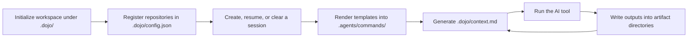

<h1 align="center">
  
</h1>

<p align="center"><strong>Session-aware runtime for AI coding workspaces</strong></p>

<p align="center">Artifact-aware prompts, deterministic startup context, and one shared on-disk contract across Claude Code, Codex, Cursor, and Trae.</p>

<p align="center">
  <code>session</code>
  ·
  <code>artifact plugin</code>
  ·
  <code>template</code>
  ·
  <code>context</code>
</p>

<p align="center">
  <code>npm i -g @whatmele/dojo</code>
</p>

## Why Dojo Exists

Most AI coding setups break down at the workspace boundary.

The model might be strong, but the surrounding runtime is still fuzzy:

- which work item is active right now?
- where should requirements, research, design, and task outputs live?
- which commands should be visible in session mode vs baseline mode?
- what should the next AI run read before it starts?

Dojo solves that layer.

It is not an agent.
It is not a Git workflow manager.
It is not a replacement for issues, reviews, or CI.

It is the runtime that makes an AI coding workspace legible, repeatable, and handoff-friendly.

## What It Gives You

Dojo gives AI tools one consistent workspace contract for:

- multi-repo workspace inventory
- lightweight session lifecycle
- artifact-aware prompt templates
- startup and handoff context generation
- reusable local extension points for templates, artifact plugins, and skills

## The Four Core Concepts

Dojo stays intentionally small.

| Concept | What it represents | Why it matters |
|---------|--------------------|----------------|
| `session` | One active work item | Selects the active artifact namespace and session-scoped commands |
| `artifact plugin` | One output type such as PRD, research, or tasks | Controls storage layout and context rendering |
| `template` | One reusable AI command contract | Gives tools a stable prompt surface tied to artifact ids, not hard-coded paths |
| `context` | Startup and handoff state | Gives the next run a trustworthy on-disk view of the workspace |

### `session`

A session owns:

- the session id and description
- optional external link metadata
- the session artifact directories under `.dojo/sessions/<session-id>/`

Dojo MVP does **not** switch repo branches.
Sessions are runtime modes, not Git layouts.

### `artifact plugin`

An artifact plugin is the only artifact extension mechanism.

It defines:

- artifact `id`
- artifact directory rule
- artifact description
- how that artifact renders into `.dojo/context.md`

Built-in artifact plugins ship for:

- `product-requirement`
- `research`
- `tech-design`
- `tasks`
- `workspace-doc`

Workspace-local artifact plugins live under `.dojo/artifacts/`.
They can be authored in `.ts` or `.js`, with TypeScript preferred.
`dojo init` installs `.dojo/types/dojo-artifact-plugin.d.ts` so plugin helpers are discoverable while authoring.

### `template`

A template is a Markdown file under `.dojo/commands/`.

Frontmatter stays intentionally small:

- `description`
- `argument-hint`
- `scope`

Template body syntax includes:

- `${session_id}`
- `${artifact_dir:<id>}`
- `${artifact_description:<id>}`
- `<!-- DOJO_SESSION_ONLY -->`
- `<!-- DOJO_NO_SESSION_ONLY -->`
- `<dojo_read_block artifacts="..." />`
- `<dojo_write_block artifact="..." />`

### `context`

`.dojo/context.md` is generated startup and handoff context.

It is not a live mirror of every file change during an already-running AI session.

Its job is to tell the next AI run:

- whether the workspace is in baseline mode or session mode
- which session is active
- which repositories are registered
- which artifact directories matter
- where to read next

## Runtime Loop

Dojo is designed as a small closed loop:



That loop is the product.

## At A Glance

| Command | What it really does |
|---------|---------------------|
| `dojo session new` | Create a new work item, activate it, and regenerate commands/context |
| `dojo session resume <id>` | Make an existing session active again |
| `dojo session none` | Return the workspace to baseline mode with no active session |
| `dojo status` | Show the current runtime overview: active session, repos, sessions, and task summary |
| `dojo repo status` | Show Git status for selected registered repos without touching session state |
| `dojo repo sync` | Run safe `git pull` across selected repos; add `--init` to clone missing configured repos and align them to configured `main_branch` |
| `dojo repo checkout <branch>` | Checkout one branch across selected repos; add `--main` to use each repo's configured main branch |
| `dojo session status` | Show details for one session |
| `dojo context reload` | Re-render commands and rebuild `.dojo/context.md` without launching a tool |
| `dojo start` | Refresh runtime state and launch the selected AI tool |
| `dojo task status` | Show the active session task overview and actionable tasks |

## Quick Start

```bash
# Install Dojo
npm install -g @whatmele/dojo

# Initialize a workspace
dojo init

# Register repositories
dojo repo add git@github.com:org/backend-service.git
dojo repo add --local ./existing-repo

# Optional lightweight Git helpers over the registered repos
dojo repo status
dojo repo sync
dojo repo sync --init
dojo repo checkout feature/auth
dojo repo checkout --main

# Create or resume a session
dojo session new
dojo session resume <session-id>
dojo session none

# Refresh context manually when needed
dojo context reload

# Validate templates
dojo template lint
dojo template lint dojo-tech-design

# Scaffold a new template or artifact plugin
dojo template create dojo-my-command --output tech-design --reads research,tasks --scope session
dojo artifact create dev-plan --description "Development plan docs." --scope session

# Launch the AI tool after refreshing runtime state
dojo start
```

## Install

```bash
npm install -g @whatmele/dojo
dojo --version
```

Or use the helper script in this repo:

```bash
bash scripts/install-dojo.sh
```

## Release

To publish the package manually from this repo:

```bash
bash scripts/release-npm.sh
```

To bump the version and publish in one go:

```bash
bash scripts/release-npm.sh 0.1.1
```

The release script checks for a clean git tree, verifies npm login, runs tests/build/pack preview, and then publishes.

## What `dojo start` Guarantees

`dojo start` is the normal entry point for day-to-day use.

Before launching the tool it will:

1. detect the active session or baseline mode
2. refresh rendered commands
3. refresh rendered skills
4. regenerate `.dojo/context.md`
5. launch the selected coding tool in the workspace root

Important behavior:

- `dojo start` does **not** try to switch Git branches
- local dirty work does **not** block `dojo start`
- the runtime state is always refreshed right before launch

That keeps Dojo lightweight and predictable.

## Repo Helpers

Dojo's repo helpers are intentionally thin wrappers over Git:

- `dojo repo status` inspects selected registered repos
- `dojo repo sync` pulls the current branch only
- `dojo repo sync --init` clones missing repos and, if `main_branch` is configured, aligns the newly cloned repo to that branch before pulling
- `dojo repo checkout --main` checks out the configured `main_branch` for each selected repo

These helpers do not touch session state and do not run stash/reset/force actions on your behalf.

## Built-in Starter Commands

| Command | Purpose | May edit product code |
|---------|---------|------------------------|
| `/dojo-init-context` | Index the workspace and refresh entry docs | No |
| `/dojo-think-and-clarify` | Clarify before committing to a plan | No |
| `/dojo-prd` | Produce product requirements | No |
| `/dojo-research` | Produce research notes | No |
| `/dojo-tech-design` | Produce technical design | No |
| `/dojo-task-decompose` | Break design into executable tasks | No |
| `/dojo-dev-loop` | Implement, test, fix, and update task state | Yes |
| `/dojo-review` | Review changes | No |
| `/dojo-commit` | Prepare a commit | No |
| `/dojo-gen-doc` | Produce or update documentation | No |

These starter commands are examples, not the product boundary.

## Real Skill Asset

Dojo ships a real authoring skill asset:

- source in this repo: [`src/skills/dojo-template-authoring/SKILL.md`](src/skills/dojo-template-authoring/SKILL.md)
- installed into a workspace by `dojo init`: `.dojo/skills/dojo-template-authoring/SKILL.md`
- materialized canonical copy: `.agents/skills/dojo-template-authoring/SKILL.md`
- supported tool symlink example: `.claude/skills/dojo-template-authoring/SKILL.md`

An AI should read that skill when it needs to:

- create or update a template
- create or update an artifact plugin
- fix template lint failures

## Source Of Truth Docs

- [docs/runtime-design.md](docs/runtime-design.md)
- [docs/template-protocol.md](docs/template-protocol.md)
- [docs/tech-design.md](docs/tech-design.md)

Archived branch-control design notes remain in `docs/session-workspace-state-*.md` for reference only. They are not the current product direction.
