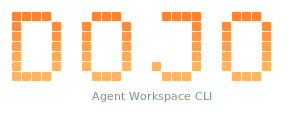

<h1 align="center">
  
</h1>

<p align="center"><strong>Agent Workspace Runtime CLI</strong> — session-aware multi-repo workspaces, artifact plugins, structured prompt templates, and startup context for AI coding tools.</p>

## What Dojo is

Dojo is a CLI harness/runtime for AI coding workspaces.

It is not an agent. It does not replace Git, CI, or issue tracking.

It gives AI tools one shared workspace contract for:

- multi-repo inventory
- session lifecycle and session switching
- artifact-aware prompt templates
- generated startup/handoff context
- built-in authoring guidance for extending the system safely

## The four core concepts

Dojo is intentionally small. The runtime should be understood through only four concepts:

1. `session`
2. `artifact plugin`
3. `template`
4. `context`

### Session

A session represents one work item. It owns:

- the session id and description
- the workspace root branch
- the participating repo branches
- the session artifact directories under `.dojo/sessions/<session-id>/`

### Artifact plugin

An artifact plugin is the only artifact extension mechanism.

It defines:

- artifact `id`
- artifact directory rule
- artifact description
- how that artifact renders into `.dojo/context.md`

Built-in artifact plugins ship for:

- `product-requirement`
- `research`
- `tech-design`
- `tasks`
- `workspace-doc`

Workspace-local artifact plugins live under `.dojo/artifacts/`.
They can be authored in `.ts` or `.js`, with TypeScript preferred.
`dojo init` installs `.dojo/types/dojo-artifact-plugin.d.ts` so plugin helpers are discoverable while authoring.

### Template

A template is a Markdown file under `.dojo/commands/`.

Templates keep frontmatter minimal and use a small Dojo syntax instead of large metadata blocks.

Frontmatter fields:

- `description`
- `argument-hint`
- `scope`

Template body syntax:

- placeholders such as `${artifact_dir:research}`
- session blocks such as `<!-- DOJO_SESSION_ONLY -->`
- directives such as `<dojo_read_block artifacts="research,tasks" />`

### Context

`.dojo/context.md` is generated startup and handoff context.

It is not a live mirror of every file change during an already-running AI session.

Its job is to tell the next AI session:

- which session is active
- which branches are active
- which artifact directories matter
- where to read next

## The closed loop

Dojo is designed as a closed loop:

1. register workspace state in `.dojo/config.json`
2. create or resume a session
3. switch the workspace root branch and repo branches together
4. materialize templates into `.agents/commands/`
5. materialize skills into `.agents/skill/` and symlink supported tool skill directories
6. run a built-in or custom template
7. write outputs into artifact plugin directories
8. regenerate `.dojo/context.md`
9. let the next prompt continue from state on disk

That loop is the product.

## What The Main Commands Actually Do

### `dojo session new` / `dojo session resume`

These commands:

1. select the active work item
2. switch the workspace root branch
3. switch the participating repo branches
4. regenerate rendered commands
5. regenerate `.dojo/context.md`

### `dojo context reload`

This command refreshes disk-backed AI state without launching a tool:

- re-renders `.agents/commands/*.md`
- regenerates `.dojo/context.md` when a session is active
- clears `.dojo/context.md` when there is no active session

### `dojo start`

This command is the usual entry point for day-to-day use:

1. detect the active session
2. refresh rendered commands
3. refresh rendered skills
4. refresh `.dojo/context.md`
5. launch the selected coding tool in the workspace root

That means the AI tool always starts from current disk state instead of stale chat-only memory.

## Quick start

```bash
# Install dependencies for this repo
npm install
npm run build

# Initialize a workspace in the current directory
dojo init

# Register repositories
dojo repo add git@github.com:org/backend-service.git
dojo repo add --local ./existing-repo

# Create or resume a session
dojo session new
dojo session resume <session-id>

# Refresh context manually when needed
dojo context reload

# Validate templates
dojo template lint
dojo template lint dojo-tech-design

# Scaffold a new template or artifact plugin
dojo template create dojo-my-command --output tech-design --reads research,tasks --scope session
dojo artifact create dev-plan --description "Development plan docs." --scope session
dojo artifact create legacy-notes --js

# Enable shell completion in zsh
echo 'source <(dojo completion zsh)' >> ~/.zshrc

# Launch the AI tool after refreshing runtime state
dojo start
```

## Built-in starter commands

| Command | Purpose | May edit product code |
|---------|---------|------------------------|
| `/dojo-init-context` | Index the workspace and refresh entry docs | No |
| `/dojo-think-and-clarify` | Clarify before committing to a plan | No |
| `/dojo-prd` | Produce product requirements | No |
| `/dojo-research` | Produce research notes | No |
| `/dojo-tech-design` | Produce technical design | No |
| `/dojo-task-decompose` | Break design into executable tasks | No |
| `/dojo-dev-loop` | Implement, test, fix, and update task state | Yes |
| `/dojo-review` | Review changes | No |
| `/dojo-commit` | Prepare a commit | No |
| `/dojo-gen-doc` | Produce or update documentation | No |

These starter commands are examples, not the product boundary.

## Real skill asset

Dojo ships a real authoring skill asset:

- source in this repo: [`src/skills/dojo-template-authoring/SKILL.md`](src/skills/dojo-template-authoring/SKILL.md)
- installed into a workspace by `dojo init`: `.dojo/skills/dojo-template-authoring/SKILL.md`
- materialized canonical copy: `.agents/skill/dojo-template-authoring.md`
- supported tool symlink example: `.claude/skills/dojo-template-authoring.md`

An AI should read that skill when it needs to:

- create or update a template
- create or update an artifact plugin
- fix template lint failures

## Template syntax

Supported placeholders:

- `${session_id}`
- `${context_path}`
- `${artifact_dir:<id>}`
- `${artifact_description:<id>}`

Supported session blocks:

- `<!-- DOJO_SESSION_ONLY --> ... <!-- /DOJO_SESSION_ONLY -->`
- `<!-- DOJO_NO_SESSION_ONLY --> ... <!-- /DOJO_NO_SESSION_ONLY -->`

Supported directives:

- `<dojo_read_block artifacts="research,tasks" />`
- `<dojo_write_block artifact="tech-design" />`

Minimal frontmatter:

```yaml
---
description: Short command description shown by tools such as Claude Code
argument-hint: [feature / scope]
scope: session
---
```

Validation:

- `dojo template lint`
- `dojo template lint dojo-my-command`
- `dojo template lint .dojo/commands/dojo-my-command.md`

## Workspace layout

```text
my-workspace/
├── .dojo/
│   ├── config.json
│   ├── state.json
│   ├── context.md
│   ├── artifacts/
│   │   └── *.{ts,js}
│   ├── commands/
│   │   └── *.md
│   ├── skills/
│   │   └── dojo-template-authoring/
│   │       └── SKILL.md
│   ├── types/
│   │   └── dojo-artifact-plugin.d.ts
│   └── sessions/
│       └── <session-id>/
│           ├── state.json
│           ├── product-requirements/
│           ├── research/
│           ├── tech-design/
│           └── tasks/
├── .agents/commands/
├── .agents/skill/
├── .claude/commands/
├── .claude/skills/
├── .trae/commands/
├── .trae/skills/
├── repos/
├── docs/
└── AGENTS.md
```

## Extending Dojo

The extension model is simple:

1. add or edit an artifact plugin under `.dojo/artifacts/`
2. add or edit a template under `.dojo/commands/`
3. reference artifact ids from the template body
4. run `dojo template lint`
5. run `dojo context reload` or `dojo start`

You do not need to fork the runtime to add a new artifact or a new template.

## How To Think About The Runtime

If you are using Dojo day to day, the practical model is:

1. `dojo session new` or `dojo session resume` decides which work item is active
2. `.dojo/commands/*.md` tells the AI what to do
3. `.dojo/artifacts/*.{ts,js}` tells Dojo where each artifact lives and how it shows up in context
4. `dojo start` refreshes rendered commands and `.dojo/context.md` before launching the coding tool

When you want to extend Dojo:

- change templates when you want a new reusable command
- change artifact plugins when you want a new output type or different context rendering
- read `.dojo/skills/dojo-template-authoring/SKILL.md` before doing either one

## Documentation

Start with these:

- [docs/runtime-design.md](docs/runtime-design.md) — concise runtime spec
- [docs/template-protocol.md](docs/template-protocol.md) — template and artifact syntax
- [docs/protocol-implementation-draft.md](docs/protocol-implementation-draft.md) — concrete config, types, and pseudocode
- [docs/tech-design.md](docs/tech-design.md) — code-level architecture
- [docs/test-plan.md](docs/test-plan.md) — verification standard
