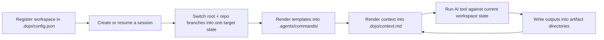

<h1 align="center">
  
</h1>

<p align="center"><strong>Session-aware runtime for AI coding workspaces</strong></p>

<p align="center">Multi-repo branch orchestration, artifact-aware prompts, deterministic startup context, and one shared contract across Claude Code, Codex, Cursor, and Trae.</p>

<p align="center">
  <code>session</code>
  ·
  <code>artifact plugin</code>
  ·
  <code>template</code>
  ·
  <code>context</code>
</p>

## Why Dojo Exists

Most AI coding setups break down at the workspace boundary.

The tool may be smart, but the environment around it is still vague:

- which work item is active right now?
- which repos and branches belong to that work item?
- where should requirements, research, design, and task outputs live?
- what should the next AI session read before it starts?

Dojo solves that layer.

It is not an agent.
It is not a replacement for Git, CI, or issue tracking.

It is the runtime that makes an AI coding workspace legible, switchable, and recoverable.

## What It Gives You

Dojo gives AI tools one consistent workspace contract for:

- multi-repo inventory and baseline branches
- session lifecycle and safe branch switching
- artifact-aware prompt templates
- startup and handoff context generation
- reusable local extension points for templates, artifact plugins, and skills

## Why It Feels Different

What makes Dojo strong is not “more prompts”.
It is that runtime state and Git state are treated as first-class product concerns.

- `session` tells Dojo which work item is active
- `template` tells the AI what to do
- `artifact plugin` tells Dojo where outputs live and how they render into context
- `context` gives the next run a deterministic on-disk handoff point

That means the AI is not starting from chat memory alone.
It is starting from a real workspace state model.

## The Four Core Concepts

Dojo stays intentionally small.
The runtime should be understandable through just four concepts.

| Concept | What it represents | Why it matters |
|---------|--------------------|----------------|
| `session` | One work item across the workspace | Lets Dojo switch root/repo branches as one coherent state |
| `artifact plugin` | One output type such as PRD, research, or tasks | Controls storage layout and context rendering |
| `template` | One reusable AI command contract | Gives tools a stable prompt surface tied to artifact ids, not hard-coded paths |
| `context` | Startup and handoff state | Gives the next run a trustworthy view of the current workspace |

### `session`

A session owns:

- the session id and description
- the workspace root branch
- the participating repo branches
- the session artifact directories under `.dojo/sessions/<session-id>/`

### `artifact plugin`

An artifact plugin is the only artifact extension mechanism.

It defines:

- artifact `id`
- artifact directory rule
- artifact description
- how that artifact renders into `.dojo/context.md`

Built-in artifact plugins ship for:

- `product-requirement`
- `research`
- `tech-design`
- `tasks`
- `workspace-doc`

Workspace-local artifact plugins live under `.dojo/artifacts/`.
They can be authored in `.ts` or `.js`, with TypeScript preferred.
`dojo init` installs `.dojo/types/dojo-artifact-plugin.d.ts` so plugin helpers are discoverable while authoring.

### `template`

A template is a Markdown file under `.dojo/commands/`.

Templates keep frontmatter minimal and use a small Dojo syntax instead of large metadata blocks.

Frontmatter fields:

- `description`
- `argument-hint`
- `scope`

Template body syntax:

- placeholders such as `${artifact_dir:research}`
- session blocks such as `<!-- DOJO_SESSION_ONLY -->`
- directives such as `<dojo_read_block artifacts="research,tasks" />`

### `context`

`.dojo/context.md` is generated startup and handoff context.

It is not a live mirror of every file change during an already-running AI session.

Its job is to tell the next AI session:

- which session or baseline mode is active
- which branches are currently expected
- which artifact directories matter
- where to read next

## Runtime Loop

Dojo is designed as a closed loop:



That loop is the product.

## At A Glance

| Command | What it really does |
|---------|---------------------|
| `dojo session new` | Define a new work item, switch branches, regenerate commands/context, and best-effort push session branches |
| `dojo session resume <id>` | Restore a previously defined branch layout and make that session active again |
| `dojo session none` | Return the workspace to baseline mode with no active session |
| `dojo status` | Show actual workspace-vs-expected branch state |
| `dojo session status` | Show detailed state for one session |
| `dojo context reload` | Re-render commands and rebuild `.dojo/context.md` without launching a tool |
| `dojo start` | Verify alignment, refresh runtime state, and launch the selected AI tool |
| `dojo task status` | Show the active session task overview and actionable tasks |

## Quick start

```bash
# Install dependencies for this repo
npm install
npm run build

# Initialize a workspace in the current directory
dojo init

# Register repositories
dojo repo add git@github.com:org/backend-service.git
dojo repo add --local ./existing-repo

# Create or resume a session
dojo session new
dojo session resume <session-id>
dojo session none

# Refresh context manually when needed
dojo context reload

# Validate templates
dojo template lint
dojo template lint dojo-tech-design

# Scaffold a new template or artifact plugin
dojo template create dojo-my-command --output tech-design --reads research,tasks --scope session
dojo artifact create dev-plan --description "Development plan docs." --scope session
dojo artifact create legacy-notes --js

# Enable shell completion in zsh
echo 'source <(dojo completion zsh)' >> ~/.zshrc

# Launch the AI tool after refreshing runtime state
dojo start
```

## What `dojo start` Guarantees

`dojo start` is the normal entry point for day-to-day use.

Before launching the tool it will:

1. detect the active session or baseline mode
2. verify the workspace branch layout is aligned
3. refresh rendered commands
4. refresh rendered skills
5. regenerate `.dojo/context.md`
6. launch the selected coding tool in the workspace root

Important behavior:

- dirty worktrees do **not** block `dojo start`
- branch/layout drift **does** block `dojo start`

That keeps the AI usable during active local work, while still preventing it from starting in the wrong workspace mode.

## Built-in starter commands

| Command | Purpose | May edit product code |
|---------|---------|------------------------|
| `/dojo-init-context` | Index the workspace and refresh entry docs | No |
| `/dojo-think-and-clarify` | Clarify before committing to a plan | No |
| `/dojo-prd` | Produce product requirements | No |
| `/dojo-research` | Produce research notes | No |
| `/dojo-tech-design` | Produce technical design | No |
| `/dojo-task-decompose` | Break design into executable tasks | No |
| `/dojo-dev-loop` | Implement, test, fix, and update task state | Yes |
| `/dojo-review` | Review changes | No |
| `/dojo-commit` | Prepare a commit | No |
| `/dojo-gen-doc` | Produce or update documentation | No |

These starter commands are examples, not the product boundary.

## Real skill asset

Dojo ships a real authoring skill asset:

- source in this repo: [`src/skills/dojo-template-authoring/SKILL.md`](src/skills/dojo-template-authoring/SKILL.md)
- installed into a workspace by `dojo init`: `.dojo/skills/dojo-template-authoring/SKILL.md`
- materialized canonical copy: `.agents/skills/dojo-template-authoring/SKILL.md`
- supported tool symlink example: `.claude/skills/dojo-template-authoring/SKILL.md`

An AI should read that skill when it needs to:

- create or update a template
- create or update an artifact plugin
- fix template lint failures

## Template syntax

Supported placeholders:

- `${session_id}`
- `${context_path}`
- `${artifact_dir:<id>}`
- `${artifact_description:<id>}`

Supported session blocks:

- `<!-- DOJO_SESSION_ONLY --> ... <!-- /DOJO_SESSION_ONLY -->`
- `<!-- DOJO_NO_SESSION_ONLY --> ... <!-- /DOJO_NO_SESSION_ONLY -->`

Supported directives:

- `<dojo_read_block artifacts="research,tasks" />`
- `<dojo_write_block artifact="tech-design" />`

Minimal frontmatter:

```yaml
---
description: Short command description shown by tools such as Claude Code
argument-hint: [feature / scope]
scope: session
---
```

Validation:

- `dojo template lint`
- `dojo template lint dojo-my-command`
- `dojo template lint .dojo/commands/dojo-my-command.md`

## Workspace layout

```text
my-workspace/
├── .dojo/
│   ├── config.json
│   ├── state.json
│   ├── context.md
│   ├── artifacts/
│   │   └── *.{ts,js}
│   ├── commands/
│   │   └── *.md
│   ├── skills/
│   │   └── dojo-template-authoring/
│   │       └── SKILL.md
│   ├── types/
│   │   └── dojo-artifact-plugin.d.ts
│   └── sessions/
│       └── <session-id>/
│           ├── state.json
│           ├── product-requirements/
│           ├── research/
│           ├── tech-design/
│           └── tasks/
├── .agents/commands/
├── .agents/skills/
├── .claude/commands/
├── .claude/skills/
├── .trae/commands/
├── .trae/skills/
├── repos/
├── docs/
└── AGENTS.md
```

## Extending Dojo

The extension model is simple:

1. add or edit an artifact plugin under `.dojo/artifacts/`
2. add or edit a template under `.dojo/commands/`
3. reference artifact ids from the template body
4. run `dojo template lint`
5. run `dojo context reload` or `dojo start`

You do not need to fork the runtime to add a new artifact or a new template.

## How To Think About The Runtime

If you are using Dojo day to day, the practical model is:

1. `dojo session new` or `dojo session resume` decides which work item is active
2. `.dojo/commands/*.md` tells the AI what to do
3. `.dojo/artifacts/*.{ts,js}` tells Dojo where each artifact lives and how it shows up in context
4. `dojo start` refreshes rendered commands and `.dojo/context.md` before launching the coding tool

When you want to extend Dojo:

- change templates when you want a new reusable command
- change artifact plugins when you want a new output type or different context rendering
- read `.dojo/skills/dojo-template-authoring/SKILL.md` before doing either one

## Documentation

Start with these:

- [docs/runtime-design.md](docs/runtime-design.md) — concise runtime spec
- [docs/template-protocol.md](docs/template-protocol.md) — template and artifact syntax
- [docs/protocol-implementation-draft.md](docs/protocol-implementation-draft.md) — concrete config, types, and pseudocode
- [docs/tech-design.md](docs/tech-design.md) — code-level architecture
- [docs/session-workspace-state-prd.md](docs/session-workspace-state-prd.md) — product model for baseline/session workspace state
- [docs/session-workspace-state-tech-design.md](docs/session-workspace-state-tech-design.md) — technical design for state control, switching, and status surfaces
- [docs/test-plan.md](docs/test-plan.md) — verification standard
